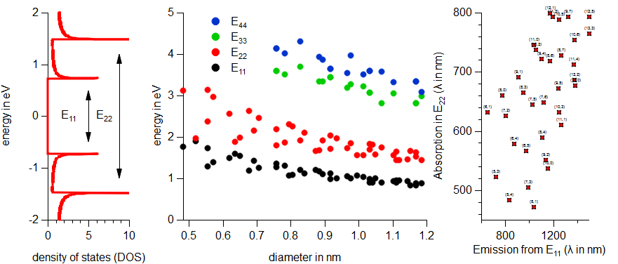
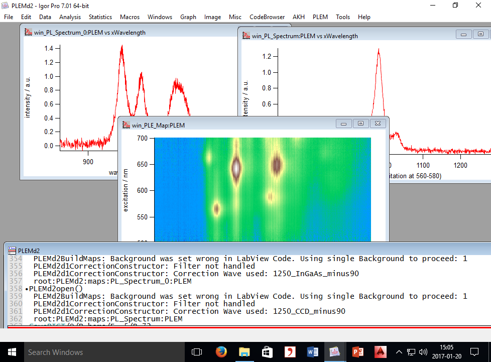
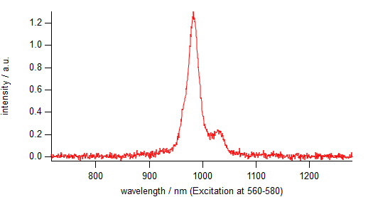
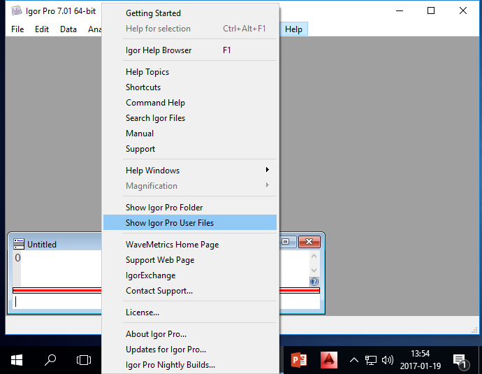

# Description
A loader/plotter for PLE Map files of carbon nanotubes. Examples for spectra and experiment files included.
The files are recorded with a [labview program](https://github.com/ukos-git/labview-plem).
This program is meant to work as a stand-alone version. Although, other packages like [the mass analysis tool](https://github.com/ukos-git/igor-swnt-massanalysis) closely rely on it and can not work without it.

# Basics of SWNT
Exciting Single Walled Carbon nanotubes to theier second subband yields emission from the first subband. see elsewhere for details.
Those energies are specific for each chirality species therefore the measurement of such photoluminescence excitation (PLE) is crucial for determining the types of chiralities that are present in the sample. This project is an analysis tool of the rather complex spectra that are merged into an image.

# Generated Spectra
The Program loads data in the Igor Binary Format (IBW) that were generated by a [home-built labview program](https://github.com/ukos-git/labview-plem)

# Installation
You can navigate to the Igor Pro User Files folder from the menu bar.

All files from the Igor Procedures Folder are loaded by default on program start. So navigate there and copy or link this Repo to your Igor Procedures Folder.

Second step is usually to copy the csv files to the User Procedures folde but one can work without the correction curves or add their own.

# Get started
Start by opening a new Igor File.
A new menu should be added to igor called "PLEM"

* Start by opening a file PLEM-->open and direct igor to the directory [spectra](/spectra/)
* Display the info tool bar PLEM-->info and the chirality panel by using PLEM-->Atlas

A [sample experiment](spectra/spectra-typical.pxp) is also included.

You can also take a look at the [spectra directory](/spectra/) to see the (rather strict) file format that is needed for the program to work.
